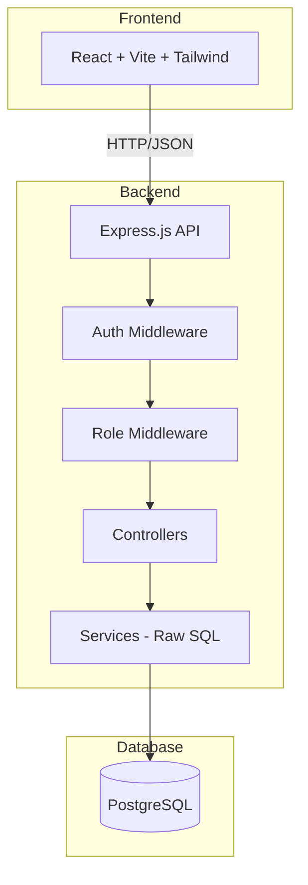

# Architecture

```mermaid
flowchart TD
    subgraph Frontend
        A[React + Vite + Tailwind]
    end

    subgraph Backend
        B[Express.js API]
        C[Auth Middleware]
        D[Role Middleware]
        E[Controllers]
        F[Services - Raw SQL]
    end

    subgraph Database
        G[(PostgreSQL)]
    end

    A -->|HTTP/JSON| B
    B --> C --> D --> E --> F --> G
```
