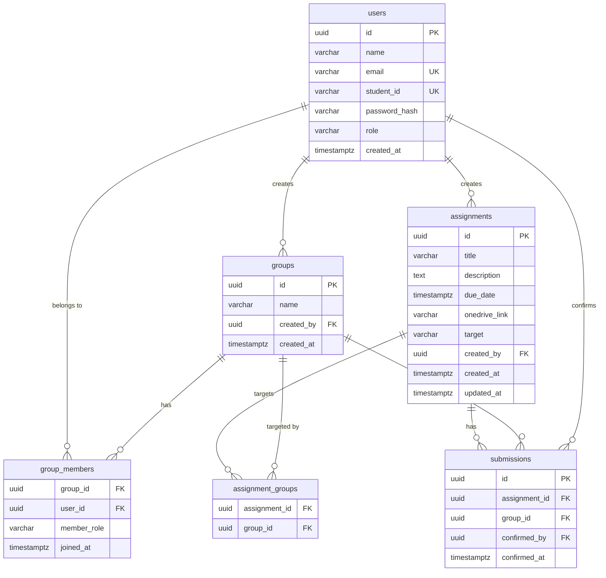

# ER Diagram

```mermaid
erDiagram
    users {
        uuid id PK
        varchar name
        varchar email UK
        varchar student_id UK
        varchar password_hash
        varchar role
        timestamptz created_at
    }

    groups {
        uuid id PK
        varchar name
        uuid created_by FK
        timestamptz created_at
    }

    group_members {
        uuid group_id FK
        uuid user_id FK
        varchar member_role
        timestamptz joined_at
    }

    assignments {
        uuid id PK
        varchar title
        text description
        timestamptz due_date
        varchar onedrive_link
        varchar target
        uuid created_by FK
        timestamptz created_at
        timestamptz updated_at
    }

    assignment_groups {
        uuid assignment_id FK
        uuid group_id FK
    }

    submissions {
        uuid id PK
        uuid assignment_id FK
        uuid group_id FK
        uuid confirmed_by FK
        timestamptz confirmed_at
    }

    users ||--o{ groups : "creates"
    users ||--o{ group_members : "belongs to"
    groups ||--o{ group_members : "has"
    users ||--o{ assignments : "creates"
    assignments ||--o{ assignment_groups : "targets"
    groups ||--o{ assignment_groups : "targeted by"
    assignments ||--o{ submissions : "has"
    groups ||--o{ submissions : "submits"
    users ||--o{ submissions : "confirms"
```
